# EarNnLearN 10M-Scale User Flow 🗺️

This diagram visualizes the high-speed registration, activation, and viral selling loop.

```mermaid
sequenceDiagram
    participant User
    participant Frontend
    participant Gateway
    participant EconomySvc as Economy Service
    participant DB as Postgre (10M Scale)
    participant Worker as Profit Worker (Celery)

    User->>Frontend: Selects Activation RID (Entry)
    User->>Frontend: Enters Sponsor code (PC-XXXX)
    Frontend->>EconomySvc: POST /activate (RID, PC)
    
    rect rgb(20, 20, 40)
        Note right of EconomySvc: 10M Scaling Logic
        EconomySvc->>DB: Check RID status (Index lookup)
        EconomySvc->>DB: Check ProductCode existence (Index lookup)
    end
    
    EconomySvc->>EconomySvc: Process Payment Verification
    
    rect rgb(0, 40, 0)
        Note right of EconomySvc: Atomic Write Loop
        EconomySvc->>DB: Update RID to USED
        EconomySvc->>DB: Create User Profile
        EconomySvc->>DB: Generate Permanent PC-XXXX for User
        EconomySvc->>DB: Create Indexed Transaction (Buyer/Seller)
    end

    EconomySvc-->>Frontend: 200 OK (User PC-XXXX assigned)
    Frontend-->>User: "Welcome! Start Learning & Sharing."

    rect rgb(40, 20, 20)
        Note right of Worker: Async Profit Split
        EconomySvc->>Worker: Trigger Profit Task
        Worker->>DB: Update Sales Count on Sponsor PC (+1)
        Worker->>DB: Distribute Profits to Wallets
    end
```

### High-Performance Keys Verified:
- **`INDEX(product_code)`**: Verified for O(1) referral lookups.
- **`INDEX(rid_code, status)`**: Verified for millisecond registration checks.
- **`INDEX(buyer_id, seller_id)`**: Verified for transaction history throughput.
